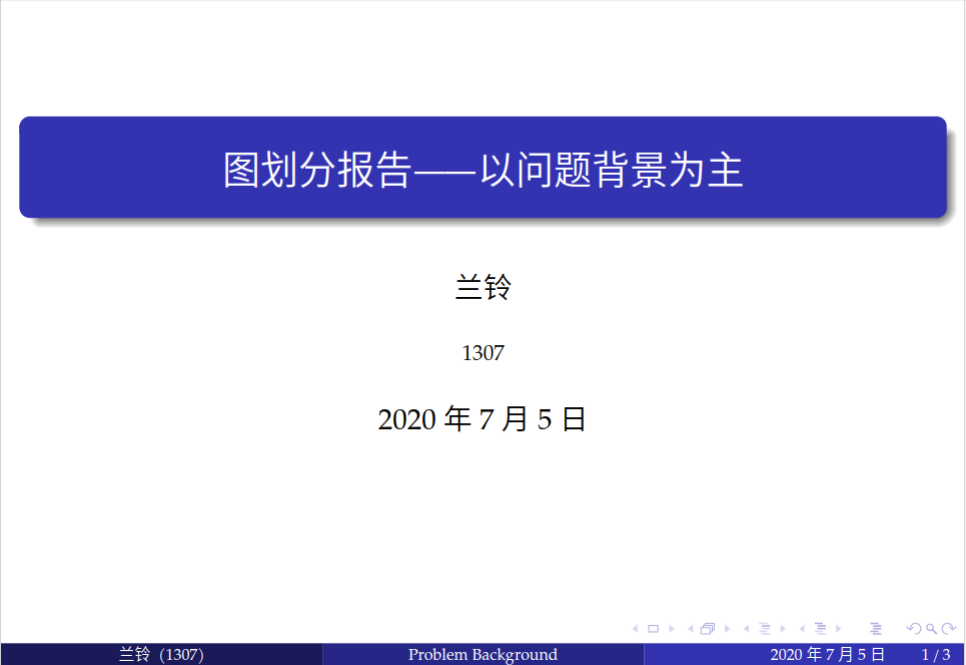
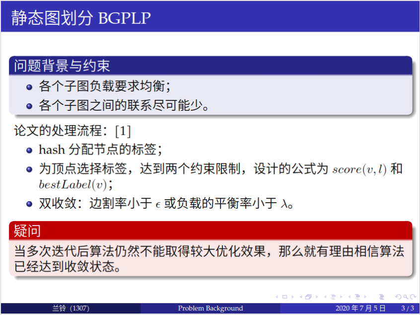
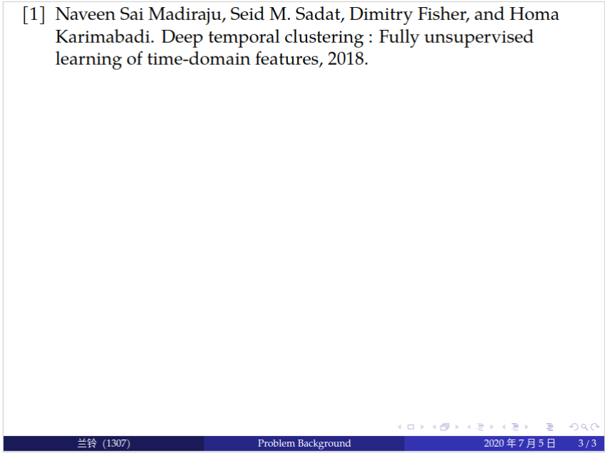

# 介绍

每次汇报都需要制作 PPT 方便展示，于是将我整理的一份 Beamer 模板的最小代码放上来（基于 ctexbeamer），方便下次使用。展示如下（个人喜欢偏清爽风格）。汉字字体为思源黑体，英文字体为 palatino，没有的化自行下载安装。

## 首页

## 内容

## 参考文献

# 致谢

https://github.com/CTeX-org/forum/issues/123